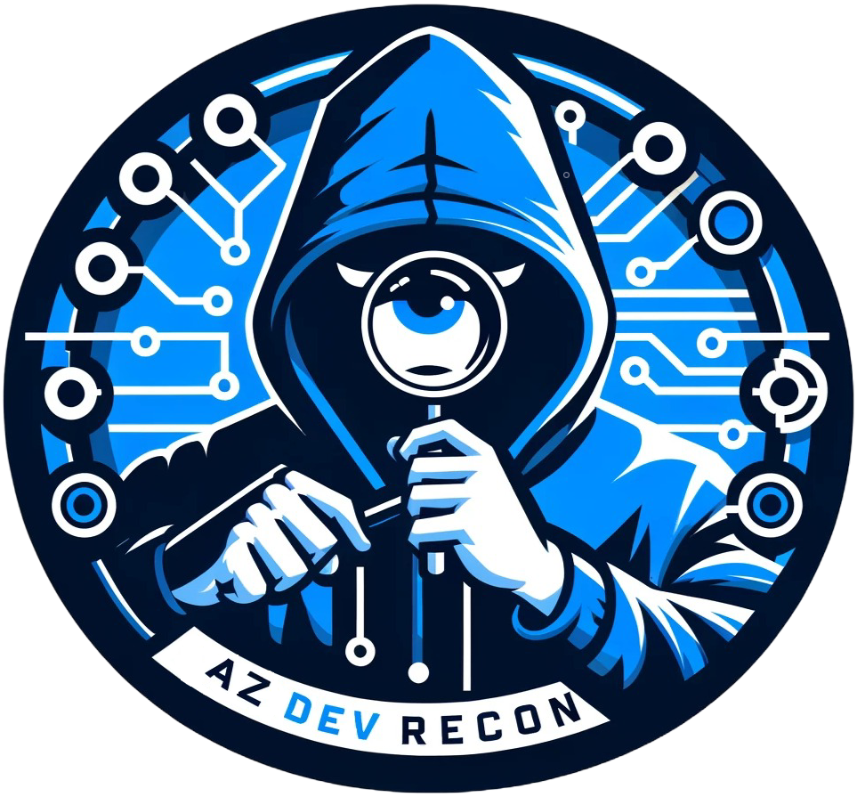

# AzDevRecon - Azure DevOps Enumeration Tool


<p align="center">
   
</p>

AzDevRecon is a **web-based enumeration tool** designed for **offensive security professionals, red teamers, and penetration testers** targeting **Azure DevOps**. It helps identify misconfigurations, exposed secrets, and security gaps by leveraging **token-based authentication** for reconnaissance and data extraction.

🔗 You can also access the tool directly here: [https://azdevrecon.cloud/](https://azdevrecon.cloud/)

## Features

- **Token-Based Enumeration** – Extract insights using Azure DevOps Access tokens or PAT.
- **Project & Repository Discovery** – Identify accessible projects and repositories.
- **Pipeline & Build Enumeration** – Analyze Azure Pipelines for security flaws.
- **Secrets & Credential Hunting** – Detect hardcoded secrets and exposed tokens.
- **User & Permission Analysis** – Map roles, permissions, and escalation paths.
- **Web-Based UI** – Easy-to-use interface for efficient enumeration.

---

## Installation

1. **Clone the repository:**

   ```sh
   git clone https://github.com/TROUBLE-1/AzDevRecon.git
   cd AzDevRecon
   ```

2. **Install dependencies:**

   ```sh
   pip install -r requirements.txt
   ```

3. **Run the application:**

   ```sh
   python app.py
   ```

4. **Access the Web UI:**\
   Open your browser and go to:

   ```
   http://localhost
   ```

---

## Usage

1. **Enter a valid Azure DevOps personal Access Token or PAT.**
2. **Select the Project for enumeration.**
3. **View discovered repositories, pipelines, commits, and secrets.**
4. **Analyze results and download repo files for further assessment.**

---

## Requirements

- Python 3.x
- Required dependencies (installed via `requirements.txt`)

---

## More Info

- Check out the [wiki](https://github.com/TROUBLE-1/AzDevRecon/wiki) for more information of the tool.

---

## Disclaimer

**AzDevRecon is intended for educational and authorized security testing purposes only.** Unauthorized use against systems without permission is illegal and strictly prohibited. Use responsibly!

---

## Contribution

Pull requests are welcome! Feel free to submit issues or feature requests.

---

## License

This project is licensed under the **MIT License**. See the `LICENSE` file for details.
